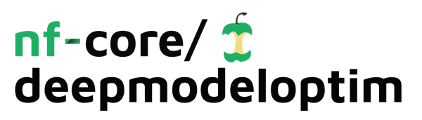

<h1>
  <picture>
    <source media="(prefers-color-scheme: dark)" srcset="docs/images/nf-core-deepmodeloptim_logo_dark.png">
    
  </picture>
</h1>

[](https://github.com/nf-core/deepmodeloptim/actions/workflows/ci.yml)
[](https://github.com/nf-core/deepmodeloptim/actions/workflows/linting.yml)[](https://nf-co.re/deepmodeloptim/results)[](https://doi.org/10.5281/zenodo.XXXXXXX)
[](https://www.nf-test.com)

[](https://www.nextflow.io/)
[](https://docs.conda.io/en/latest/)
[](https://www.docker.com/)
[](https://sylabs.io/docs/)
[](https://cloud.seqera.io/launch?pipeline=https://github.com/nf-core/deepmodeloptim)

[](https://nfcore.slack.com/channels/deepmodeloptim)[](https://twitter.com/nf_core)[](https://mstdn.science/@nf_core)[](https://www.youtube.com/c/nf-core)

## Introduction

**nf-core/deepmodeloptim** is a bioinformatics end-to-end pipeline that performs statistically testing training procedures of machine learning models.

Deep learning model development in natural science is an empirical and costly process. Users must define a pre-processing pipeline, an architecture, find the best parameters for said architecture and iterate over this process.

Leveraging the power of Nextflow (polyglotism, container integration, scalable on the cloud), we propose STIMULUS, an open-source software built to automatize deep learning model development for genomics.

STIMULUS takes as input a user defined PyTorch model, a dataset, a configuration file to describe the pre-processing steps to be performed, and a range of parameters for the PyTorch model. It then transforms the data according to all possible pre-processing steps, finds the best architecture parameters for each of the transformed datasets, performs sanity checks on the models and train a minimal deep learning version for each dataset/architecture.

Those experiments are then compiled into an intuitive report, making it easier for scientists to pick the best design choice to be sent to large scale training.


## Usage

> [!NOTE]
> If you are new to Nextflow and nf-core, please refer to [this page](https://nf-co.re/docs/usage/installation) on how to set-up Nextflow. Make sure to [test your setup](https://nf-co.re/docs/usage/introduction#how-to-run-a-pipeline) with `-profile test` before running the workflow on actual data.

<!-- TODO nf-core: Describe the minimum required steps to execute the pipeline, e.g. how to prepare samplesheets.
     Explain what rows and columns represent. For instance (please edit as appropriate):

First, prepare a samplesheet with your input data that looks as follows:

`samplesheet.csv`:

```csv
sample,fastq_1,fastq_2
CONTROL_REP1,AEG588A1_S1_L002_R1_001.fastq.gz,AEG588A1_S1_L002_R2_001.fastq.gz
```

Each row represents a fastq file (single-end) or a pair of fastq files (paired end).

-->

Now, you can run the pipeline using:

<!-- TODO nf-core: update the following command to include all required parameters for a minimal example -->

```bash
nextflow run nf-core/deepmodeloptim \
   -profile <docker/singularity/.../institute> \
   --input samplesheet.csv \
   --outdir <OUTDIR>
```

> [!WARNING]
> Please provide pipeline parameters via the CLI or Nextflow `-params-file` option. Custom config files including those provided by the `-c` Nextflow option can be used to provide any configuration _**except for parameters**_; see [docs](https://nf-co.re/docs/usage/getting_started/configuration#custom-configuration-files).

For more details and further functionality, please refer to the [usage documentation](https://nf-co.re/deepmodeloptim/usage) and the [parameter documentation](https://nf-co.re/deepmodeloptim/parameters).

## Pipeline output

To see the results of an example test run with a full size dataset refer to the [results](https://nf-co.re/deepmodeloptim/results) tab on the nf-core website pipeline page.
For more details about the output files and reports, please refer to the
[output documentation](https://nf-co.re/deepmodeloptim/output).

<!-- TODO
 Reconciliate previous readme with a nf-core format one.
-->

## Code requirements

### Data

The data is provided as a csv where the header columns are in the following format : name:type:class

_name_ is user given (note that it has an impact on experiment definition).

_type_ is either "input", "meta", or "label". "input" types are fed into the mode, "meta" types are registered but not transformed nor fed into the models and "label" is used as a training label.

_class_ is a supported class of data for which encoding methods have been created, please raise an issue on github or contribute a PR if a class of your interest is not implemented

#### csv general example

| input1:input:input_type | input2:input:input_type | meta1:meta:meta_type | label1:label:label_type | label2:label:label_type |
| ----------------------- | ----------------------- | -------------------- | ----------------------- | ----------------------- |
| sample1 input1          | sample1 input2          | sample1 meta1        | sample1 label1          | sample1 label2          |
| sample2 input1          | sample2 input2          | sample2 meta1        | sample2 label1          | sample2 label2          |
| sample3 input1          | sample3 input2          | sample3 meta1        | sample3 label1          | sample3 label2          |

#### csv specific example

| mouse_dna:input:dna | mouse_rnaseq:label:float |
| ------------------- | ------------------------ |
| ACTAGGCATGCTAGTCG   | 0.53                     |
| ACTGGGGCTAGTCGAA    | 0.23                     |
| GATGTTCTGATGCT      | 0.98                     |

### Model

In STIMULUS, users input a .py file containing a model written in pytorch (see examples in bin/tests/models)

Said models should obey to minor standards:

1. The model class you want to train should start with "Model", there should be exactly one class starting with "Model".

```python

import torch
import torch.nn as nn

class SubClass(nn.Module):
    """
    a subclass, this will be invisible to Stimulus
    """

class ModelClass(nn.Module):
    """
    the PyTorch model to be trained by Stimulus, can use SubClass if needed
    """

class ModelAnotherClass(nn.Module):
    """
    uh oh, this will return an error as there are two classes starting with Model
    """

```

2. The model "forward" function should have input variables with the **same names** as the defined input names in the csv input file

```python

import torch
import torch.nn as nn

class ModelClass(nn.Module):
    """
    the PyTorch model to be trained by Stimulus
    """
    def __init__():
        # your model definition here
        pass

    def forward(self, mouse_dna):
        output = model_layers(mouse_dna)

```

3. The model should include a **batch** named function that takes as input a dictionary of input "x", a dictionary of labels "y", a Callable loss function and a callable optimizer.

In order to allow **batch** to take as input a Callable loss, we define an extra compute_loss function that parses the correct output to the correct loss class.

```python

import torch
import torch.nn as nn
from typing import Callable, Optional, Tuple

class ModelClass(nn.Module):
    """
    the PyTorch model to be trained by Stimulus
    """

    def __init__():
        # your model definition here
        pass

    def forward(self, mouse_dna):
        output = model_layers(mouse_dna)

    def compute_loss_mouse_rnaseq(self, output: torch.Tensor, mouse_rnaseq: torch.Tensor, loss_fn: Callable) -> torch.Tensor:
        """
        Compute the loss.
        `output` is the output tensor of the forward pass.
        `mouse_rnaseq` is the target tensor -> label column name.
        `loss_fn` is the loss function to be used.

        IMPORTANT : the input variable "mouse_rnaseq" has the same name as the label defined in the csv above.
        """
        return loss_fn(output, mouse_rnaseq)

    def batch(self, x: dict, y: dict, loss_fn: Callable, optimizer: Optional[Callable] = None) -> Tuple[torch.Tensor, dict]:
        """
        Perform one batch step.
        `x` is a dictionary with the input tensors.
        `y` is a dictionary with the target tensors.
        `loss_fn` is the loss function to be used.

        If `optimizer` is passed, it will perform the optimization step -> training step
        Otherwise, only return the forward pass output and loss -> evaluation step
        """
        output = self.forward(**x)
        loss = self.compute_loss_mouse_rnaseq(output, **y, loss_fn=loss_fn)
        if optimizer is not None:
            optimizer.zero_grad()
            loss.backward()
            optimizer.step()
        return loss, output

```

If you don't want to optimize the loss function, the code above can be written in a simplified manner

```python

import torch
import torch.nn as nn
from typing import Callable, Optional, Tuple

class ModelClass(nn.Module):
    """
    the PyTorch model to be trained by Stimulus
    """

    def __init__():
        # your model definition here
        pass

    def forward(self, mouse_dna):
        output = model_layers(mouse_dna)

    def batch(self, x: dict, y: dict, optimizer: Optional[Callable] = None) -> Tuple[torch.Tensor, dict]:
        """
        Perform one batch step.
        `x` is a dictionary with the input tensors.
        `y` is a dictionary with the target tensors.
        `loss_fn` is the loss function to be used.

        If `optimizer` is passed, it will perform the optimization step -> training step
        Otherwise, only return the forward pass output and loss -> evaluation step
        """
        output = self.forward(**x)
        loss = nn.MSELoss(output, y['mouse_rnaseq'])
        if optimizer is not None:
            optimizer.zero_grad()
            loss.backward()
            optimizer.step()
        return loss, output

```

### Model parameter search design

### Experiment design

The file in which all information about how to handle the data before tuning is called an `experiment_config`. This file in `.json` format for now but it will be soon moved to `.yaml`. So this section could vary in the future.

The `experiment_config` is a mandatory input for the pipeline and can be passed with the flag `--exp_conf` followed by the `PATH` of the file you want to use. Two examples of `experiment_config` can be found in the `examples` directory.

### Experiment config content description.

## Credits

<!-- TODO
    Update the author list
-->

nf-core/deepmodeloptim was originally written by Mathys Grappote.

We thank the following people for their extensive assistance in the development of this pipeline:

<!-- TODO nf-core: If applicable, make list of people who have also contributed -->

## Contributions and Support

If you would like to contribute to this pipeline, please see the [contributing guidelines](.github/CONTRIBUTING.md).

For further information or help, don't hesitate to get in touch on the [Slack `#deepmodeloptim` channel](https://nfcore.slack.com/channels/deepmodeloptim) (you can join with [this invite](https://nf-co.re/join/slack)).

## Citations

<!-- TODO nf-core: Add citation for pipeline after first release. Uncomment lines below and update Zenodo doi and badge at the top of this file. -->
<!-- If you use nf-core/deepmodeloptim for your analysis, please cite it using the following doi: [10.5281/zenodo.XXXXXX](https://doi.org/10.5281/zenodo.XXXXXX) -->

<!-- TODO nf-core: Add bibliography of tools and data used in your pipeline -->

An extensive list of references for the tools used by the pipeline can be found in the [`CITATIONS.md`](CITATIONS.md) file.

You can cite the `nf-core` publication as follows:

> **The nf-core framework for community-curated bioinformatics pipelines.**
>
> Philip Ewels, Alexander Peltzer, Sven Fillinger, Harshil Patel, Johannes Alneberg, Andreas Wilm, Maxime Ulysse Garcia, Paolo Di Tommaso & Sven Nahnsen.
>
> _Nat Biotechnol._ 2020 Feb 13. doi: [10.1038/s41587-020-0439-x](https://dx.doi.org/10.1038/s41587-020-0439-x).
